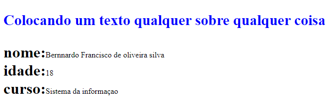

<h1>


<p align="center">Bernnardo francisco de oliveira silva </p>
</h1>


## 📕 ABOUT 

Este projeto é uma Prova de Conceito que demonstra como funcionam as media queries no CSS. O objetivo é explorar diferentes regras de media queries para adaptar o layout e o estilo de uma página web em diversos cenários e dispositivos.

## 📌 Tecnologias Utilizadas
- html
- CSS3 (Media Queries)

##

<p align="center">Print -normal</p> 
 

<p align="center">or impressao</p> 
 


```bash
# Print (apenas impressão): Estilos específicos para quando a página é impressa. 

<link rel="stylesheet" type="text/css" media="print" href="screen.css">#LINKANDO PARA CSS COM A IMPRESSAO
p{
    font-size: 30px;
    font-weight: bold;
    color: yellow;
    border-bottom: black;
}
.amarela{
    background-color: blue;
}

body{
    text-align:  center;
    border-bottom: black;
}


div{
    border: 1px solid black;
}


h1{
    color: tomato;
}


```


## 🎈 media queries 


## max-width 576px sm 
<p align="center"> Nesse projeto para para a altura minima de 576px irei utilizar as cores:</p>

```bash
# yellow , rgb(0, 255, 234) , rgb(255, 0, 200) 


```
 

## max-width 768px md
<p align="center"> Nesse projeto para para a altura minima de 768px irei utilizar as cores:</p>

```bash
# rgb(128, 0, 0) , rgb(216, 66, 12), rgb(200, 255, 0) , 


```
 


## max-width 992px lg 
<p align="center"> Nesse projeto para para a altura minima de 992px irei utilizar as cores:</p>

```bash
#  rgb(38, 0, 128), rgb(12, 151, 216), rgb(98, 0, 255)


```


## max-width 1200px xl
<p align="center"> Nesse projeto para para a altura minima de 992px irei utilizar as cores:</p>

```bash
#  green


```


